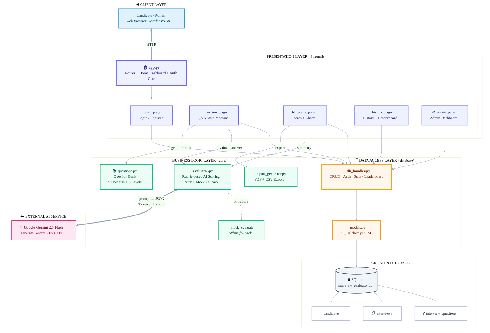

# 🏗️ System Architecture — AI Interview Evaluator

> Layered, loosely-coupled architecture. Each layer can be replaced independently.
> Render this on GitHub (auto-renders) or paste into https://mermaid.live

## Layer Responsibilities

| Layer | Files | Responsibility |
|---|---|---|
| 🌐 **Client** | Browser | Candidate & admin interact via web UI |
| 🎨 **Presentation** | `app.py`, `ui/*` | Streamlit pages, routing, session state |
| 🧠 **Business Logic** | `core/*` | AI scoring, question bank, report generation |
| 🗄️ **Data Access** | `database/*` | CRUD, auth, stats via SQLAlchemy ORM |
| ☁️ **External** | Gemini API | AI evaluation of answers (with retry + fallback) |
| 💾 **Storage** | SQLite | `candidates`, `interviews`, `interview_questions` |

**Key resilience flow:** `evaluator.py` → Gemini (3× retry, exponential backoff) → on total failure → `mock_evaluate` → app never crashes.
