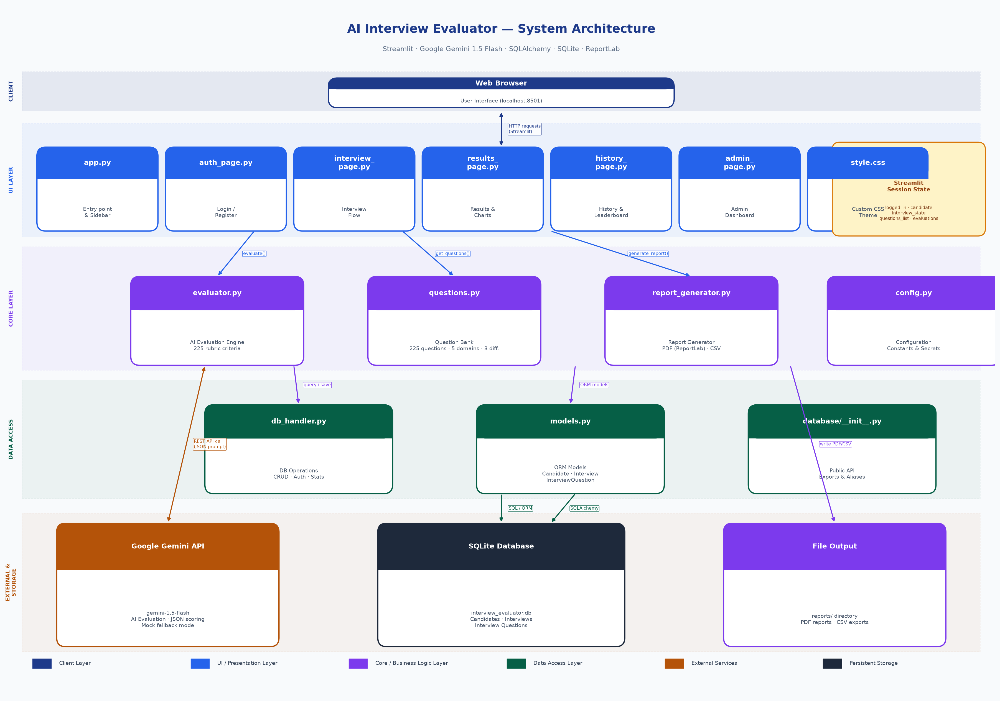

# 🎯 AI Interview Evaluator

> An AI-powered interview preparation platform built with **Streamlit** and **Google Gemini 1.5 Flash**.  
> Practice technical and behavioural interviews across 5 domains, receive instant rubric-based AI feedback, track performance trends, download PDF/CSV reports, and compete on a leaderboard — all in a single-page web app.

---

## Project Overview

The AI Interview Evaluator is a full-stack Python web application designed to simulate real interview sessions and provide objective, AI-driven evaluation. It addresses the gap between self-study and actual interview preparedness by giving candidates structured, immediate feedback after every answer.

### Key Features

| Feature | Details |
|---|---|
| **5 Interview Domains** | Software Engineering · System Design · Data Science & ML · HR / Behavioral · Product Management |
| **3 Difficulty Levels** | Easy · Medium · Hard |
| **225 Question Bank** | 15 questions per domain-difficulty combination (5 × 3 × 15) |
| **AI Evaluation** | Google Gemini 1.5 Flash scores each answer 1–10 with strengths, improvements, and model hint |
| **Rubric-Based Scoring** | 4 weighted criteria per domain (e.g. Technical Accuracy 35 %, Depth 25 %, Communication 25 %, Problem-Solving 15 %) |
| **Performance Analytics** | Trend charts, radar plots, grade breakdowns via Plotly |
| **PDF/CSV Export** | Multi-page ReportLab PDF with cover, performance summary, Q&A analysis, and recommendations |
| **History & Leaderboard** | Interview timeline, domain filters, grade filters, privacy-masked global leaderboard |
| **Admin Dashboard** | Platform stats, domain analytics, candidate management, score distribution, export tools |
| **Mock / Offline Mode** | `USE_MOCK=true` — evaluates without any API call; scores realistically in 4–9 range |

---

## System Architecture Diagram



The system is structured in **6 layers**:
1. **Client Layer** — Web browser accessing Streamlit at `localhost:8501`  
2. **UI / Presentation Layer** — Streamlit pages (`app.py`, `auth_page`, `interview_page`, `results_page`, `history_page`, `admin_page`)  
3. **Core / Business Logic Layer** — `evaluator.py` (AI engine), `questions.py` (question bank), `report_generator.py` (PDF/CSV)  
4. **Data Access Layer** — `db_handler.py` (CRUD + stats), `models.py` (SQLAlchemy ORM)  
5. **External Services** — Google Gemini 1.5 Flash REST API  
6. **Persistent Storage** — SQLite database (`interview_evaluator.db`)

---

## Folder Structure

```
AI_Interview_Evaluator/
├── app.py                         # Streamlit entry point + page router + home dashboard
├── config.py                      # All configuration constants (domains, difficulty, colours)
├── requirements.txt               # Python dependencies
├── .env                           # Environment variables (API keys) — do NOT commit
├── .env.example                   # Template for .env — commit this
├── .gitignore
│
├── core/
│   ├── evaluator.py               # Google Gemini evaluation engine + mock mode + retry logic
│   ├── questions.py               # 225-question bank across 5 domains × 3 difficulty levels
│   └── report_generator.py        # Multi-page PDF (ReportLab) + CSV export
│
├── database/
│   ├── models.py                  # SQLAlchemy ORM: Candidate, Interview, InterviewQuestion
│   ├── db_handler.py              # All DB operations (register, login, save, fetch, stats)
│   └── __init__.py                # Public API exports + backward-compat aliases
│
├── ui/
│   ├── auth_page.py               # Login / Register + init_session_state()
│   ├── interview_page.py          # Interview state machine (not_started → in_progress → evaluating → completed)
│   ├── results_page.py            # Score hero, charts, Q&A breakdown, AI summary, export
│   ├── history_page.py            # Interview history cards + global leaderboard
│   └── admin_page.py              # Admin dashboard (restricted to is_admin=True)
│
├── assets/
│   └── style.css                  # Custom CSS theme (Inter font, purple/teal palette)
│
├── reports/                       # Auto-created directory for exported PDF/CSV files
│
├── System_Architecture_Diagram.png   # Deliverable 1 — Architecture diagram
├── generate_architecture_diagram.py  # Script to regenerate the diagram
└── generate_documentation.py         # Script to regenerate the documentation PDF
```

---

## Dependencies

All dependencies are in `requirements.txt`:

```
streamlit>=1.32.0       # Web application framework
google-genai>=1.0.0     # Google Gemini AI SDK
sqlalchemy>=2.0.0       # ORM for SQLite database
python-dotenv>=1.0.0    # .env file loader
reportlab>=4.1.0        # PDF generation
matplotlib>=3.8.0       # Charts + architecture diagram
numpy>=1.26.0           # Numerical operations (admin analytics)
plotly>=5.20.0          # Interactive charts in the UI
pandas>=2.2.0           # Tabular data + CSV export
Pillow>=10.0.0          # Image handling for PDF
fpdf2>=2.7.0            # Legacy PDF (kept for compatibility)
```

---

## Setup Instructions

### Prerequisites

- Python 3.10 or later
- pip
- (Optional) A Google Gemini API key — free tier available

### Step 1 — Clone the repository

```bash
git clone https://github.com/<your-username>/AI_Interview_Evaluator.git
cd AI_Interview_Evaluator
```

### Step 2 — Create and activate a virtual environment

```bash
python -m venv venv

# macOS / Linux
source venv/bin/activate

# Windows (PowerShell)
venv\Scripts\Activate.ps1
```

### Step 3 — Install dependencies

```bash
pip install -r requirements.txt
```

### Step 4 — Configure environment variables

```bash
cp .env.example .env
```

Open `.env` and fill in your values:

```env
GEMINI_API_KEY=your_actual_gemini_api_key_here
ADMIN_PASSWORD=admin123
USE_MOCK=false
```

Get a **free** Gemini API key at [https://aistudio.google.com/app/apikey](https://aistudio.google.com/app/apikey).

> **Offline / Demo mode:** Set `USE_MOCK=true` to skip all API calls. The evaluator returns realistic scores (4–9) and placeholder feedback — no API key needed.

---

## Execution Steps

### Run the application

```bash
streamlit run app.py
```

The app opens automatically at **[http://localhost:8501](http://localhost:8501)**.

### Demo credentials (auto-seeded on first run)

| Role | Email | Password |
|---|---|---|
| Demo User | `demo@test.com` | `demo123` |
| Administrator | `admin@ai.com` | `admin123` |

> These accounts are created automatically when `init_db()` runs on the first launch — no manual setup required.

### Workflow

1. **Register** a new account or log in with demo credentials  
2. Click **"Start Interview"** in the sidebar or use **Quick Start** on the Home page  
3. Select Domain, Difficulty, and Number of Questions (5 / 7 / 10)  
4. Answer each question in the text area and click **Submit Answer** (or **Skip**)  
5. Review AI feedback after each answer, then proceed to the next  
6. After the last question, click **View Final Results** for the full breakdown  
7. Download the **PDF** or **CSV** report from the Results page  
8. View all past interviews and the **Leaderboard** in the History tab

### Regenerate deliverable files

```bash
# Regenerate the architecture diagram (PNG)
python generate_architecture_diagram.py

# Regenerate the project documentation (PDF)
python generate_documentation.py
```

---

## Additional Project Details

### Grading Scale

| Percentage | Letter Grade |
|---|---|
| ≥ 90% | A+ |
| ≥ 80% | A |
| ≥ 72% | B+ |
| ≥ 64% | B |
| ≥ 56% | C+ |
| ≥ 48% | C |
| ≥ 35% | D |
| < 35% | F |

### Evaluation Rubric (per domain)

Each answer is scored on 4 weighted criteria. Example for **Software Engineering**:

| Criterion | Weight |
|---|---|
| Technical Accuracy | 35% |
| Depth & Completeness | 25% |
| Communication Clarity | 25% |
| Problem-Solving Approach | 15% |

### Environment Variables

| Variable | Required | Default | Description |
|---|---|---|---|
| `GEMINI_API_KEY` | Yes (unless mock) | — | Google Gemini API key |
| `ADMIN_PASSWORD` | No | `admin123` | Admin account password |
| `USE_MOCK` | No | `false` | Set `true` for offline demo mode |

### Database

The app uses SQLite (no separate server needed). The database file is created automatically at `database/interview_evaluator.db` on first run.

**Tables:**
- `candidates` — registered users with hashed passwords
- `interviews` — completed interview sessions with aggregate scores
- `interview_questions` — individual question/answer/evaluation records

### Admin Panel

Log in as `admin@ai.com / admin123` and navigate to **Admin Panel** in the sidebar to access:
- Platform-wide statistics
- Domain analytics with grouped bar charts
- Searchable candidates table
- Recent activity feed
- Score distribution histogram
- Bulk CSV export and user management

---

## Deployment

### Streamlit Community Cloud (Free)

1. Push this repository to GitHub  
2. Go to [https://share.streamlit.io](https://share.streamlit.io) and connect your repo  
3. Set the main file to `app.py`  
4. Add your secrets in the Streamlit Cloud **Secrets** panel:
   ```toml
   GEMINI_API_KEY = "your_key_here"
   USE_MOCK = "false"
   ```
5. Click **Deploy**

### Docker (Alternative)

```dockerfile
FROM python:3.11-slim
WORKDIR /app
COPY requirements.txt .
RUN pip install --no-cache-dir -r requirements.txt
COPY . .
EXPOSE 8501
CMD ["streamlit", "run", "app.py", "--server.port=8501", "--server.address=0.0.0.0"]
```

---

## Technology Stack

| Component | Technology | Version |
|---|---|---|
| Web Framework | Streamlit | ≥ 1.32 |
| AI Engine | Google Gemini 1.5 Flash | via `google-genai` |
| Database ORM | SQLAlchemy | ≥ 2.0 |
| Database | SQLite | Built-in |
| Charts | Plotly | ≥ 5.20 |
| PDF Export | ReportLab | ≥ 4.1 |
| Language | Python | 3.10+ |

---

## GitHub Repository

> 🔗 **Repository:** `https://github.com/<your-username>/AI_Interview_Evaluator`

> ⚠️ Replace `<your-username>` with your actual GitHub username before submission.

---

## License

MIT License — free to use, modify, and distribute with attribution.
# AI-Interview-Evaluator
